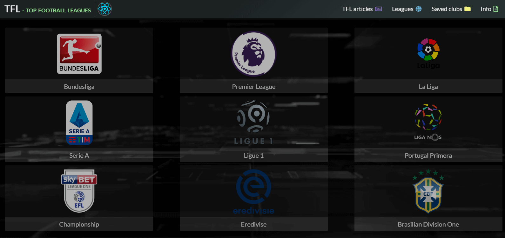

# TFL - Top Football Leagues

## [Deploy - https://tfl-app.netlify.app](https://tfl-app.netlify.app "TFL - top football leagues")


### Tools:


***

## Description
Hi! This application is intended for all users, but more for football fans. In the application you can find information on football leagues, teams, players. You can read articles, comment on them. Articles are added by application administrators. The application has a limit on the number of requests behind the data. If the request limit is exceeded, a message will be displayed in modal window.


[](https://tfl-app.netlify.app)

***
## Get started:
**1. Clone this repo:**
``` command
git clone git@github.com:HL-Dz/FTL-app.git
```
**2. Go to directory:**
``` command
cd ftl-app
```
**3. Install all dependencies:**
``` command
npm ci
```
**4. Start dev server:**
``` command
npm run start
```
**5. Builds the app for production to the build folder.:**
``` command
npm run build
```